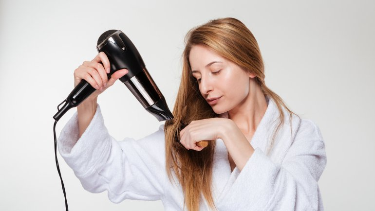

Suczenie
===========

Po myciu straj się nie osuszać włosów poprzez intensywne wyciskanie czy pocieranie ręcznikiem, powoduje to uszkodznia mechaniczne i osłabienie włosów. Zamiast suszenie włosów suszarką warto pozwolić im wyschnąć naturalnie, lecz pamiętaj aby nie kłąść się spać w mokrych włosach. Jeśli jednak masz grube bądź długie włosy warto je jednak podsuszyć. Zadbaj o to aby suszyć je chłodnym powietrzem od nasady w dół, ponieważ dzięki temu struktura włosa nie zostaje naruszona.  

    podpis

Przy wyborze suszarki należy zwrócic uwagę na:

-moc i wydajność

-siłę i prędkość nawiewu

-regulację temperatury

-jonizację
